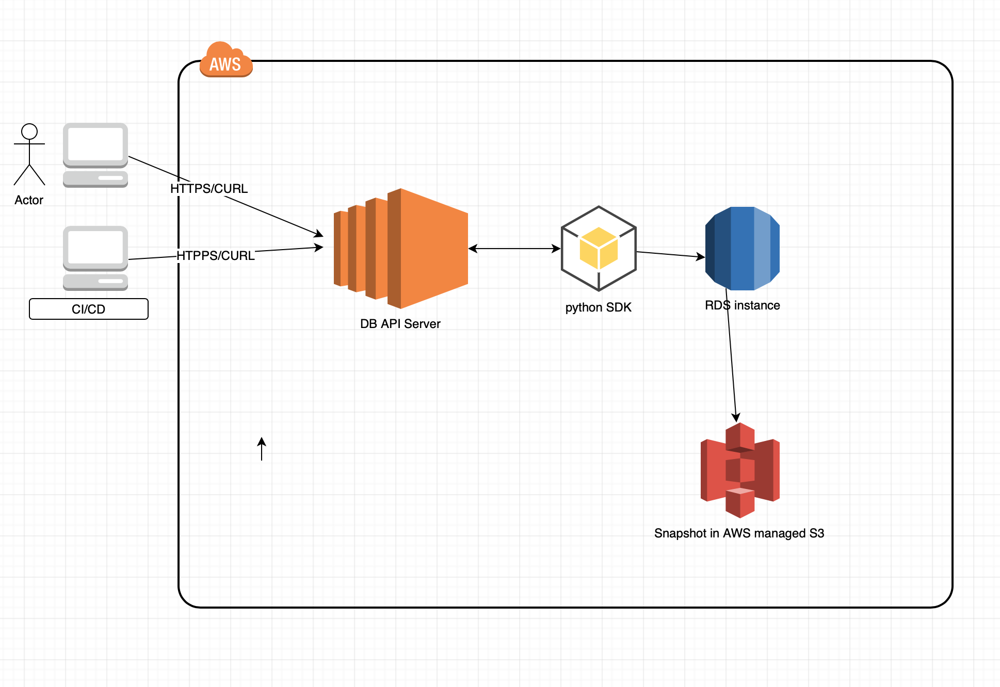
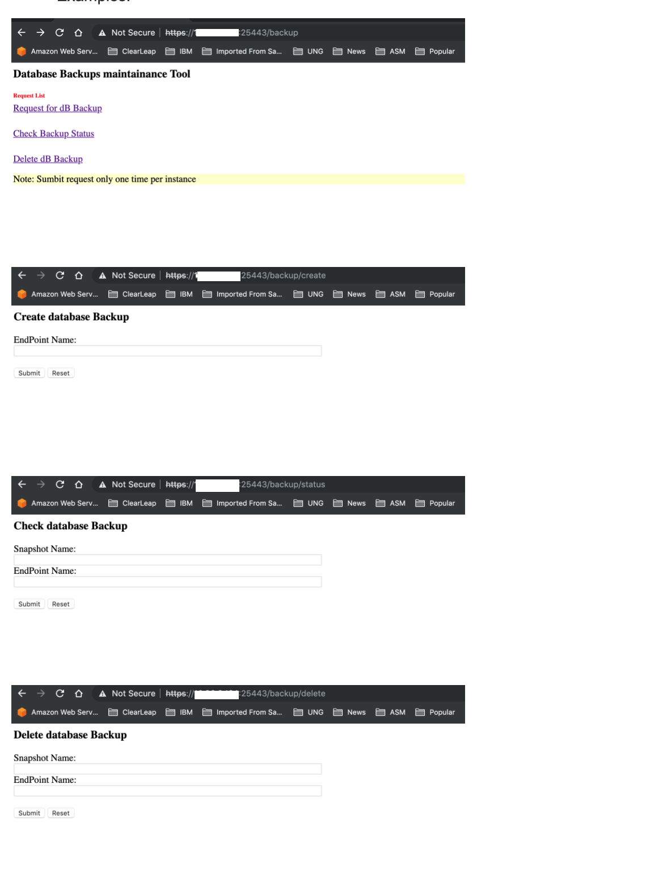

## Introduction

    This source code is an example of taking an automatic on-demand backup of an RDS instance running in AWS VPC using AWS Python SDK (boto3). Alternatively 
## Setup Instructions:

    $ python3 -V
    Python 3.8.5
    $ pip install -r requirements.txt --user
    #find where to copy libraries - for example
    $ python3 -c "import sys; print(sys.path)"
    output: 
    ['', '/Users/skondla/miniconda3/lib/python38.zip', '/Users/skondla/miniconda3/lib/python3.8', '/Users/skondla/miniconda3/lib/python3.8/lib-dynload', '/Users/skondla/miniconda3/lib/python3.8/site-packages']

## Alternatively cp files in lib directory to common python libriary (check version) 
    sudo cp lib/rdsAdmin.py /usr/lib/python2.7

## Change appConfig.yaml hostname and port matching your host IP
## scheduled to run in cron
    #DB webApp
    */5 * * * * /usr/bin/flock -n /tmp/fullWebapp.lock python /data2/api/db/dbWebAPI.py > /data2/api/db/log 2>&1
    
## How to Access webApp via HTTPS or CURL

    #Main Page

    #https://10.10.x.x:25443/backup

    #create cluster db snapshot
  
    curl -k https://10.10.x.x:25443/backup/create \
    --data "endpoint=tve-integ-postgresdb-aurora.cluster-ro-ckbgoobdxe24.us-east-1.rds.amazonaws.com"; \
    echo
  
    [//]: # (https://10.10.x.x:25443/backup/create)  

    #check cluster db snapshot
  
    curl -k https://10.10.x.x:25443/backup/status \
    --data "snapshotname=tve-integ-postgresdb-aurora-snapshot-2019-06-23-22-21-57" \
    --data "endpoint=tve-integ-postgresdb-aurora.cluster-ro-ckbgoobdxe24.us-east-1.rds.amazonaws.com"; \
    echo
  
    #https://10.10.x.x:25443/backup/status

    #delete cluster db snapshot
  
    curl -k https://10.10.x.x:25443/backup/delete \
    --data "snapshotname=tve-integ-postgresdb-aurora-snapshot-2019-06-23-22-21-57" \
    --data "endpoint=tve-integ-postgresdb-aurora.cluster-ro-ckbgoobdxe24.us-east-1.rds.amazonaws.com"; \
    echo
  
    #https://10.10.x.x:25443/backup/delete

##  Checking Connections
    * Troubleshooting*

  
    admin@ip-10-96-6-124:/data2/api/db$ ps -ef|grep dbWebAPI.py 
    admin    13047 13042  0 21:00 ?        00:00:00 /bin/sh -c /usr/bin/flock -n /tmp/fullWebapp.lock python /data2/api/db/dbWebAPI.py > /data2/api/db/log 2>&1
    admin    13051 13047  0 21:00 ?        00:00:00 /usr/bin/flock -n /tmp/fullWebapp.lock python /data2/api/db/dbWebAPI.py
    admin    13054 13051  6 21:00 ?        00:00:00 python /data2/api/db/dbWebAPI.py
    admin    13256 13054  6 21:00 ?        00:00:00 python /data2/api/db/dbWebAPI.py
    admin    13454 12829  0 21:00 pts/0    00:00:00 grep dbWebAPI.py
    admin@ip-10-96-6-124:/data2/api/db$ netstat -an | grep 10.96.6.124
    tcp        0      0 10.96.6.124:25443       0.0.0.0:*               LISTEN     
    tcp        0     36 10.96.6.124:22          10.200.209.167:63473    ESTABLISHED
    udp        0      0 10.96.6.124:123         0.0.0.0:*                          
    admin@ip-10-96-6-124:/data2/api/db$ lsof -i :25443
    COMMAND   PID  USER   FD   TYPE DEVICE SIZE/OFF NODE NAME
    python  13054 admin    4u  IPv4  38308      0t0  TCP ip-10.96.6.124.clearleap.com:25443 (LISTEN)
    python  13256 admin    4u  IPv4  38308      0t0  TCP ip-10.96.6.124.clearleap.com:25443 (LISTEN)
  

## Architecture flow

HTML interface example: 

# webApp
#Contact: skondla@me.com
